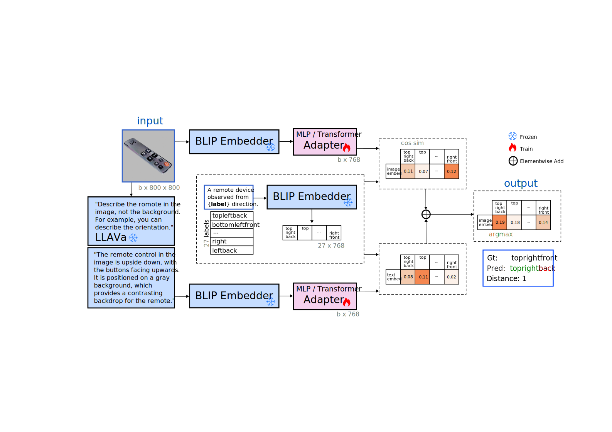
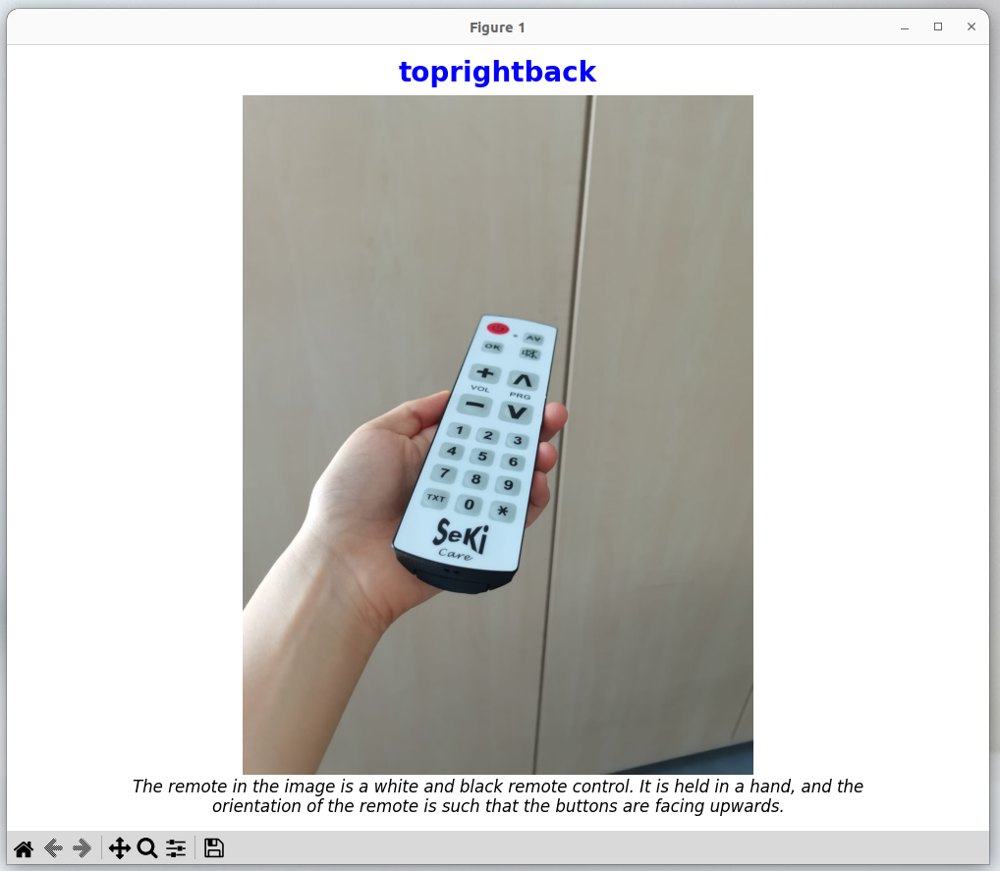

## Environment

~~~
python 3.9 cuda 118 recommended
pip install -r requirements.txt
~~~

## Train

~~~
python VLMClassifier.py
~~~

## Architecture

## Evaluation CLIP

## Evaluation BLIP

## Results on Validation Data
| Nr. | VLM  | Method  | Features       | Acc_3↑ | Acc_2↑ | Acc_1↑ |
|-----|------|---------|----------------|--------|--------|--------|
| 0   | CLIP | ZeroShot| Image          | 6%     | 25%    | 70%    |
| 1   | CLIP | ZeroShot| Image, Text    | 5%     | 32%    | 76%    |
| 2   | CLIP | Adapter | Image          | 34%    | 72%    | 96%    |
| 3   | CLIP | Adapter | Image, Text    | 37%    | _78%_  | **98%**|
| 4   | BLIP | ZeroShot| Image          | 5%     | 33%    | 80%    |
| 5   | BLIP | ZeroShot| Image, Text    | 4%     | 28%    | 74%    |
| 6   | BLIP | Adapter | Image          | _42%_  | 76%    | _97%_  |
| 7   | BLIP | Adapter | Image, Text    | **43%**| **80%**| **98%**|

- **Acc_3** (all 3 directions correct)
- **Acc_2** (at least 2 directions correct)
- **Acc_1** (at least 1 direction correct)

## Demo "single image inference"
