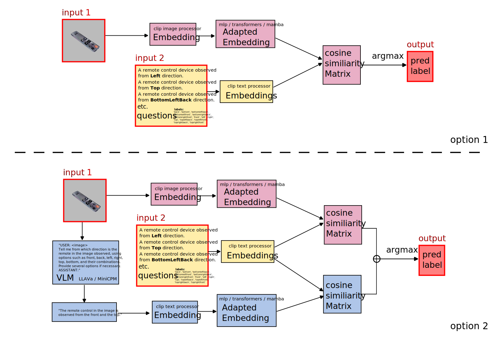

## Environment

~~~
python 3.9 cuda 118 recommended
pip install -r requirements.txt
~~~

~~~
cd pytorch-gradual-warmup-lr/
python setup.py install (pip install .)
cd ..
~~~

## Train

~~~
python VLMClassifier.py
~~~

## Architecture
